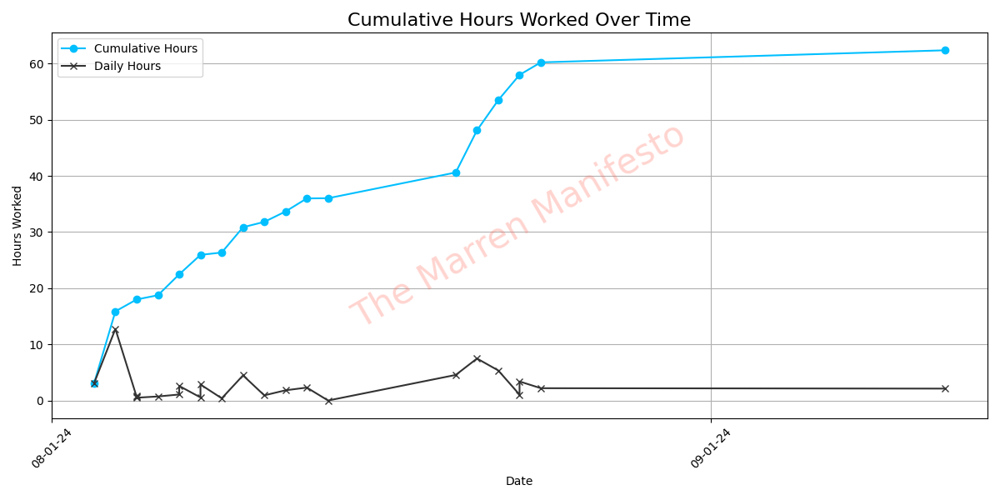

    <h2>Welcome to my GitHub</h1>
    
Hi 👋, my name's <a href="https://themarrenmanifesto.com" target="_blank">Luke</a>!

    
I'm currently a senior in Econometrics with minors in Computer Science and Statistics at UIUC 🎓.

    
I'm on the hunt 🏹 for <a href="https://www.linkedin.com/in/luke-marren-aa9912206/" target="_blank">work</a> in data analytics, data science, and SWE ⌨️.

    
Thanks for visiting my profile 😊!

    <h2>My Projects</h2>
    <table>
        <tr>
            <td><a href="https://github.com/lmarren1/the-marren-manifesto/" target="_blank">The Marren Manifesto</a>
My website / blog for tracking my progress towards mastery in software development.
</td>
        </tr>
        <tr>
            <td><a href="https://github.com/lmarren1/nba-threes-since-1979" target="_blank">Nba Threes Since 1979</a>
RShiny app displaying graphical and tabular NBA 3-point data.
</td>
        </tr>
    </table>
    <h2>My Software Development Progress</h2>
    
Last Updated: August 24th

    <a href="https://themarrenmanifesto.com" target="_blank"></img></a>
    
59 / 10,000 hours (0.59%)

    <h2>Contacts / Content</h2>
    <a href="https://www.linkedin.com/in/luke-marren-aa9912206/" target="_blank">
LinkedIn
</a>
    <a href="https://themarrenmanifesto.com">
My Blog
</a>

